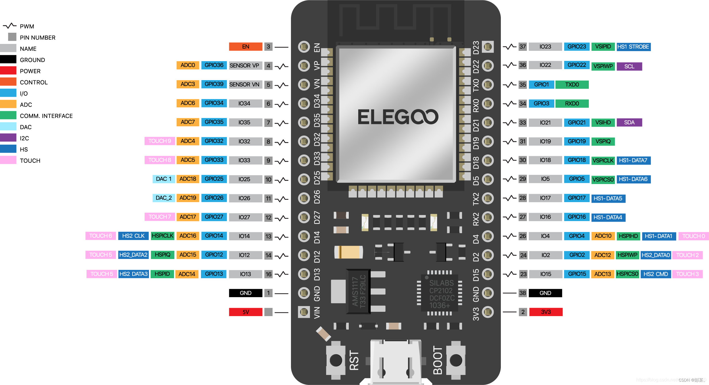

# smart-furniture

A repo for development and testing of our own smart furniture line.

## Elegoo ESP32 DEVKIT  V1

- On Arduino IDE, appears as the DOIT ESP32 DEVKIT V1

### Setup

Follow [this](https://randomnerdtutorials.com/installing-esp32-arduino-ide-2-0/) guide* to set up the Arduino IDE for usage.

For Windows, had to install [this](https://www.silabs.com/software-and-tools/usb-to-uart-bridge-vcp-drivers?utm_source=chatgpt.com&tab=downloads) driver as well to connect to the ESP32 through USB.

*\*There is a note here about Arduino IDE 1.x supporting more ESP packages, but until we see problems I don't think we have any problems. Otherwise, use [this](https://randomnerdtutorials.com/installing-the-esp32-board-in-arduino-ide-windows-instructions/) guide.*

### Things to look into...

- [esp-now](https://github.com/espressif/esp-now): An ESP32 one-to-many or many-to-many communication protocol that uses a specialized communication protocol, abstracting away the network through application layer reuslting in faster transmission
    - Also see [here](https://randomnerdtutorials.com/esp-now-esp32-arduino-ide/) for tutorials
- [LittleFS](https://randomnerdtutorials.com/arduino-ide-2-install-esp32-littlefs/): How to upload files to the ESP32